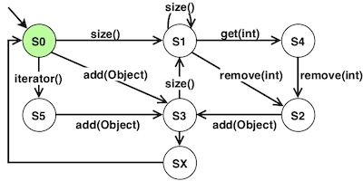

# EvoSuite Behavioral Models Seeding Tutorial

Welcome to this tutorial on behavioral model seeding for [EvoSuite](http://www.evosuite.org)!

## Introduction to Behavioral Models Seeding

The goal of behavioral model seeding (denoted model seeding hereafter) is to abstract the behavior of the software under test using models and use that abstraction during the search. At the unit test level, each model is a transition system, like in the following Figure:



 A model represents possible usages of a class (a `List` in this case): i.e., the possible sequences of method calls observed for objects of that class. For instance, the transition system model in the  Figure above has been partially generated from the following call sequences:
```
<size(), remove(), add(Object), size(), size(), size(), get(), remove(), add(Object)>
<iterator(),add(Object)>
...
```
Each transition (each arrow in the Figure) corresponds to a method call in one of the sequences, and for each sequence, there exists a path in the model.
From the model we can derive usages of the `List` and use those during the unit test generation process each time a `List` is required during the creation of a test case.

The main steps of our model seeding approach are:
- the inference of the individual models from the call sequences collected through static analysis performed on the application code, and dynamic analysis of the test cases; and
- for each model, the selection of usages using the test case generation process.

For more details on model seeding, please see the [STAMP Deliverable D3.3 - Prototype of amplification tool for common and anomaly behaviors](https://github.com/STAMP-project/docs-forum/blob/master/docs/d33_prototype_of_amplification_tool_for_common_and_anomaly_behaviors.pdf).

In the next steps, we will explain how to set up the example project used in this tutorial ([AuthZForce](https://authzforce.ow2.org)); how to generate behavioral models from the source code and test execution of an application using static and dynamic analysis; and how to use those models to _seed_ the test case generation process of EvoSuite.

First, lets clone this repository locally:

```bash
git clone https://github.com/STAMP-project/evosuite-model-seeding-tutorial.git
cd evosuite-model-seeding-tutorial
```

_Note:_ The project used as example in this tutorial is Maven based. However, the model generation and unit test generation are called using plain command line and can be adapted to any kind of Java project. It only requires to build a class path to the for the project and its dependencies.

## Example project: AuthZForce

This tutorial illustrates how to generate unit tests for [AuthZForce](https://authzforce.ow2.org), an Attribute-Based Access Control framework. More specifically, we will use the [`authzforce-core`](https://gitlab.ow2.org/authzforce/core) Maven project. Lets clone and build the latest version of the project locally:

```bash
git clone --branch release-13.3.1 https://gitlab.ow2.org/authzforce/core authzforce-core
cd authzforce-core
```
To execute test cases, `authzforce-core` requires the following environment variables:

```bash
export AUTHZFORCE_DATA_DIR=/tmp/authzforce
export MAVEN_OPTS="-Djavax.xml.accessExternalSchema=all"
```

You can now package the application and execute the test cases to check that everything works fine:

```bash
mvn clean install
```

Since the model generation and EvoSuite rely on an instrumentation of the binaries, the tools require to have access to the binaries of the project and all its dependencies. To download a copy of the `authzforce-core` dependencies, you can call  the [`maven-dependency-plugin`](https://maven.apache.org/plugins/maven-dependency-plugin/) plugin from `authzforce-core/` with following command:

```bash
mvn org.apache.maven.plugins:maven-dependency-plugin:copy-dependencies
```

For the remainder of this tutorial, we will focus on the `authzforce-ce-core-pdp-engine` module.

### Test coverage analysis

Optionally, you can run a test coverage analysis of the manually written test suite to compare it with the test suite generated by EvoSuite. For line and brach coverage, you can use [JaCoCo](https://www.jacoco.org). From the **root directory**, execute after downloading and packaging `authzforce-core`:

```bash
cd authzforce-core/pdp-engine/
mvn org.jacoco:jacoco-maven-plugin:prepare-agent test org.jacoco:jacoco-maven-plugin:report
```

The results are available in `authzforce-core/pdp-engine/target/site/jacoco`.

For mutation coverage, you can use [PIT](http://pitest.org). From the **root directory**, execute after downloading and packaging `authzforce-core`:

```bash
cd authzforce-core/pdp-engine/
mvn org.pitest:pitest-maven:mutationCoverage
```

The results are available in `authzforce-core/pdp-engine/target/pit-reports`. You can save the different coverage results in a different location for latter comparison with the test cases generated by EvoSuite.

## Behavioral models learning

Before proceeding to the rest of the tutorial, let's come back to the **root directory** using `cd ..` if you are in `authzforce-core/` directory of `cd ../..` if you are in the `authzforce-core/pdp-engine/` directory. 

Behavioral models represent the usages of the different objects involved in the project. To learn (i.e., generate) behavioral models for an application, we will use a utility called `botsing-model-generation` that (i) statically analyses the source code of the project and (ii) executes the test cases to capture usages of the objects.

The analysis and (latter) unit test generation require to access the `.class` and dependencies of AuthZForce to work. Lets first export the class path by running the following command (for Linux and Mac):

```bash
export authzforce_classpath="authzforce-core/pdp-engine/target/classes:authzforce-core/pdp-engine/target/dependency/Saxon-HE-9.8.0-12.jar:authzforce-core/pdp-engine/target/dependency/activation-1.1.jar:authzforce-core/pdp-engine/target/dependency/animal-sniffer-annotations-1.14.jar:authzforce-core/pdp-engine/target/dependency/authzforce-ce-core-pdp-api-15.3.0.jar:authzforce-core/pdp-engine/target/dependency/authzforce-ce-pdp-ext-model-7.5.1.jar:authzforce-core/pdp-engine/target/dependency/authzforce-ce-xacml-model-7.5.1.jar:authzforce-core/pdp-engine/target/dependency/authzforce-ce-xmlns-model-7.5.1.jar:authzforce-core/pdp-engine/target/dependency/checker-compat-qual-2.0.0.jar:authzforce-core/pdp-engine/target/dependency/error_prone_annotations-2.1.3.jar:authzforce-core/pdp-engine/target/dependency/guava-24.1.1-jre.jar:authzforce-core/pdp-engine/target/dependency/hamcrest-core-1.3.jar:authzforce-core/pdp-engine/target/dependency/j2objc-annotations-1.1.jar:authzforce-core/pdp-engine/target/dependency/javax.mail-1.6.0.jar:authzforce-core/pdp-engine/target/dependency/javax.mail-api-1.6.0.jar:authzforce-core/pdp-engine/target/dependency/jaxb2-basics-runtime-1.11.1.jar:authzforce-core/pdp-engine/target/dependency/jcl-over-slf4j-1.7.25.jar:authzforce-core/pdp-engine/target/dependency/jsr305-1.3.9.jar:authzforce-core/pdp-engine/target/dependency/junit-4.11.jar:authzforce-core/pdp-engine/target/dependency/logback-classic-1.2.3.jar:authzforce-core/pdp-engine/target/dependency/logback-core-1.2.3.jar:authzforce-core/pdp-engine/target/dependency/slf4j-api-1.7.25.jar:authzforce-core/pdp-engine/target/dependency/spring-core-4.3.20.RELEASE.jar:authzforce-core/pdp-engine/target/dependency/xml-resolver-1.2.jar"
```

If you use Windows Powershell, you will have to use the following command:

```bash
export authzforce_classpath="authzforce-core/pdp-engine/target/classes;authzforce-core/pdp-engine/target/dependency/Saxon-HE-9.8.0-12.jar;authzforce-core/pdp-engine/target/dependency/activation-1.1.jar;authzforce-core/pdp-engine/target/dependency/animal-sniffer-annotations-1.14.jar;authzforce-core/pdp-engine/target/dependency/authzforce-ce-core-pdp-api-15.3.0.jar;authzforce-core/pdp-engine/target/dependency/authzforce-ce-pdp-ext-model-7.5.1.jar;authzforce-core/pdp-engine/target/dependency/authzforce-ce-xacml-model-7.5.1.jar;authzforce-core/pdp-engine/target/dependency/authzforce-ce-xmlns-model-7.5.1.jar;authzforce-core/pdp-engine/target/dependency/checker-compat-qual-2.0.0.jar;authzforce-core/pdp-engine/target/dependency/error_prone_annotations-2.1.3.jar;authzforce-core/pdp-engine/target/dependency/guava-24.1.1-jre.jar;authzforce-core/pdp-engine/target/dependency/hamcrest-core-1.3.jar;authzforce-core/pdp-engine/target/dependency/j2objc-annotations-1.1.jar;authzforce-core/pdp-engine/target/dependency/javax.mail-1.6.0.jar;authzforce-core/pdp-engine/target/dependency/javax.mail-api-1.6.0.jar;authzforce-core/pdp-engine/target/dependency/jaxb2-basics-runtime-1.11.1.jar;authzforce-core/pdp-engine/target/dependency/jcl-over-slf4j-1.7.25.jar;authzforce-core/pdp-engine/target/dependency/jsr305-1.3.9.jar;authzforce-core/pdp-engine/target/dependency/junit-4.11.jar;authzforce-core/pdp-engine/target/dependency/logback-classic-1.2.3.jar;authzforce-core/pdp-engine/target/dependency/logback-core-1.2.3.jar;authzforce-core/pdp-engine/target/dependency/slf4j-api-1.7.25.jar;authzforce-core/pdp-engine/target/dependency/spring-core-4.3.20.RELEASE.jar;authzforce-core/pdp-engine/target/dependency/xml-resolver-1.2.jar"
```

We can now launch the models generation by executing the following commands from the **root directory**:

```bash
java -d64 -Xmx10000m -jar bin/botsing-model-generation-1.0.4-SNAPSHOT-jar-with-dependencies.jar \
	-project_cp "$authzforce_classpath" \
	-project_prefix "org.ow2.authzforce" \
	-out_dir "results/authzforce-core"
```
Where
- `-project_cp "$authzforce_project_cp"` provides the class path;
- `-project_prefix "org.ow2.authzforce"` tells Botsing to run the test cases that are in the package `org.ow2.authzforce` or one of its sub-packages; and
- `-out_dir "results/authzforce-core"` specifies the output directory for the models (models are generated in `results/authzforce-core/models`).

## EvoSuite

[EvoSuite](http://www.evosuite.org) is a unit test generator for Java applications. It implements several evolutionary algorithms and has benefits from many advances over the years. One of the key functionality of EvoSuite when generating test for a Class Under Test (CUT) is to be able to generate and initialize complex objects used by the CUT. This generation however is random or based solely on the existing test cases by carving (i.e., copy-pasting) objects and methods called on those objects from the existing test cases. With model seeding, we seek to enhance this functionality by using the models learned from the source code and the existing tests.

We can run EvoSuite using the following (quite long) command line from the **root directory**:
```bash
java -d64 -Xmx4000m -jar bin/evosuite-master-1.0.7-SNAPSHOT.jar \
	-class "org.ow2.authzforce.core.pdp.impl.PdpBean" \
	-projectCP "$authzforce_classpath" \
	-generateMOSuite \
	-Dalgorithm=DynaMOSA \
	-Dsearch_budget=60 \
	-Dseed_clone="0.5" \
	-Donline_model_seeding=TRUE \
	-Dmodel_path="results/authzforce-core/models" \
	-Dtest_dir="results/authzforce-core/evosuite-tests" \
	-Dreport_dir="results/authzforce-core/evosuite-report" \
	-Dno_runtime_dependency=true
```
Where
- `-class "org.ow2.authzforce.core.pdp.impl.PdpBean"` define the class under test for which test cases will be generated. It is also possible to generate a test suite for a whole package using the `-prefix "org.ow2.authzforce.core.pdp.impl"` option (see [EvoSuite command line documentation](http://www.evosuite.org/documentation/commandline/) for more details);
- `-projectCP "$authzforce_classpath"` provides the class path of the software under test (see previous section to set the `authzforce_classpath` variable);
- `-generateMOSuite` and `-Dalgorithm=DynaMOSA` indicate to EvoSuite to use a multiobjectives evolutionary strategy witht the [DynaMOSA](https://ieeexplore.ieee.org/document/7840029) algorithm;
- `-Dsearch_budget=60` indicates the search budget in seconds allocated to EvoSuite to generate tests;
- `-Dseed_clone="0.5"` is the probability to use objects generated from the models. In our case, there is one chance out of two when an object is required to generate it from the models or to randomly generate a new one during the search;
- `-Donline_model_seeding=TRUE` indicates to generate objects from the models during the search. If this option is set to false, EvoSuite will initialize a pool of objects (by generating them from the models) during the initialization phase and pick objects only from that pool during the search. This option should be set to `FALSE` only if there is a large amount of objects required during the search when generating test cases for a given class;
-  `-Dmodel_path="results/authzforce-core/models"` indicates the path where to find the models. Each file should be named after the class it models;
- `-Dtest_dir="results/authzforce-core/evosuite-tests"` indicates where EvoSuite will generate the test cases;
- `-Dreport_dir="results/authzforce-core/evosuite-report"` indicates where EvoSuite will generate the report on the generated tests;
- `-Dno_runtime_dependency=true` indicates to EvoSuite to generate plain JUnit test without a dependency to `org.evosuite:evosuite-standalone-runtime`. By default, EvoSuite generates JUnit tests relying on the EvoSuite framework to, amongst other things, decrease the risk of flakiness.

The generated tests are available in `results/authzforce-core/evosuite-tests` and can be reviewed to improve or correct the oracle (mainly, the assertions) before beeing added to the test suite of the project.

In our case, the test cases can also be directly added to the `authzforce-ce-core-pdp-engine` module before running a new coverage analysis to see improvements.

## Funding

Botsing is partially funded by research project STAMP (European Commission - H2020) ICT-16-10 No.731529.


